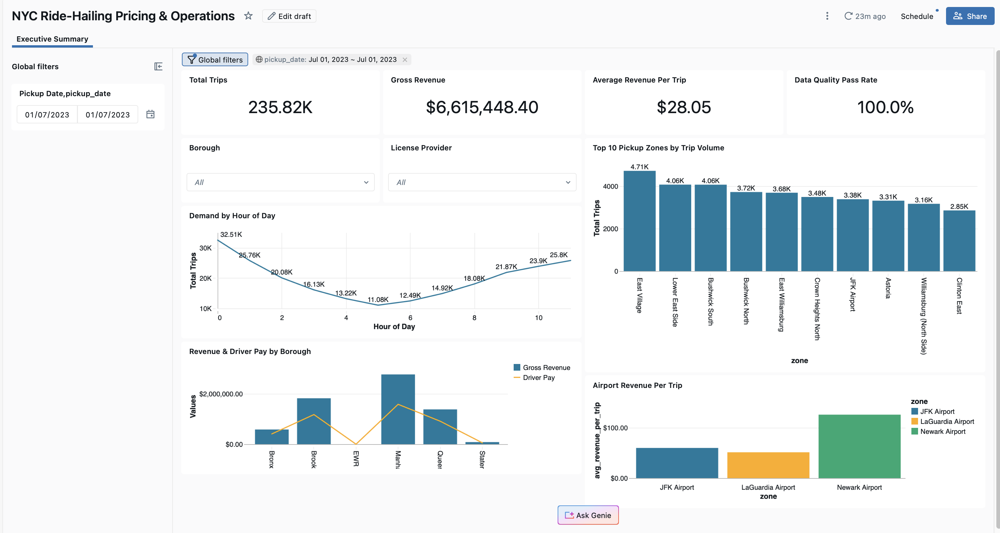
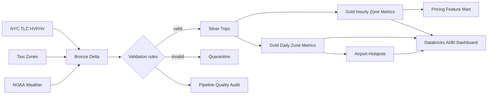

# NYC Ride-Hailing Analytics Engineering on Databricks

This project modernises a large-scale NYC ride-hailing analysis as a Databricks medallion pipeline. It transforms raw High-Volume For-Hire Vehicle (HVFHV), taxi-zone and weather data into validated Delta tables and curated metrics for pricing, operations and demand modelling, with built-in quality checks, traceable processing and AI/BI reporting.



## Sample-run results

The demonstrated run used a locally prepared sample of 250,000 public TLC trip records. After validation, the dashboard reports:

| Metric | Result |
|---|---:|
| Trusted trips | 235.82K |
| Gross revenue | $6.62M |
| Average revenue per trip | $28.05 |
| Data-quality pass rate | 100.0% |

The sample intentionally covers only hours present in the extracted batch. Data is not distributed through this repository; `scripts/prepare_databricks_sample.py` recreates the sample from the authoritative public sources. The pipeline can process the full July–December 2023 source files when run in an environment with sufficient capacity and outbound access.

## Architecture



The design is documented in [Architecture](docs/ARCHITECTURE.md), [Data dictionary](docs/DATA_DICTIONARY.md) and [Operations runbook](docs/OPERATIONS.md).

## Engineering highlights

- Parameterised ingestion for one or multiple months.
- Unity Catalog schema and Volume-based raw-file governance.
- Delta Lake Bronze, Silver and Gold tables.
- SHA-256 trip keys and idempotent Delta `MERGE` ingestion.
- Row-level quarantine with explicit failure reasons.
- Deduplication using a latest-record window.
- Data-quality assertions and an append-only audit table.
- Weather and taxi-zone enrichment for pricing features.
- Analysis-ready hourly, daily and airport data products.
- AI/BI dashboard with KPI cards, filters and decision-focused charts.
- Legacy notebook chain retained with execution outputs and visualisations for migration traceability.

## Repository layout

```text
.
├── databricks/
│   └── ride_hailing_medallion_pipeline.py
├── docs/
│   ├── ARCHITECTURE.md
│   ├── DATA_DICTIONARY.md
│   ├── MIGRATION_NOTES.md
│   ├── OPERATIONS.md
│   └── dashboard.png
├── notebooks/legacy/
├── scripts/
│   ├── download_legacy_sources.py
│   ├── prepare_databricks_sample.py
│   └── validate_repo.py
├── sql/dashboard_queries.sql
└── requirements.txt
```

## Run in Databricks

1. Clone this repository or download it as a ZIP.
2. Create the local demonstration files from the public sources. They are written to the ignored `data/local/` directory and are never committed:

   ```bash
   python -m venv .venv
   source .venv/bin/activate
   pip install pandas pyarrow
   python scripts/prepare_databricks_sample.py
   ```

3. Import `databricks/ride_hailing_medallion_pipeline.py` into a Databricks workspace.
4. Run the notebook's setup cell to create the `workspace.ride_hailing` schema and `ride_hailing_raw` Volume.
5. Upload these locally generated files to the Volume:

   ```text
   data/local/fhvhv_tripdata_2023-07_sample.parquet
   data/local/taxi_zone_lookup.parquet
   data/local/weather_2023.parquet
   ```

   Destination:

   ```text
   /Volumes/workspace/ride_hailing/ride_hailing_raw/
   ```

6. Keep the default parameters:

   ```text
   catalog=workspace
   schema=ride_hailing
   year=2023
   months=07
   source_mode=uploaded_sample
   include_pluto=false
   ```

7. Run all cells. Inspect `pipeline_quality_audit`, the quarantine table and the Gold tables before building the dashboard queries in `sql/dashboard_queries.sql`.

For a full run, use `source_mode=public_download` and set `months=07,08,09,10,11,12`. Databricks Free Edition may block source downloads or be too small for the full dataset; use the included sample for a reliable demonstration.

## Data products

| Layer | Product | Purpose |
|---|---|---|
| Bronze | `bronze_hvfhv_trips` | Source-aligned trips plus ingestion metadata |
| Bronze | `bronze_taxi_zones` | Raw lookup data |
| Bronze | `bronze_weather` | Raw NOAA observations |
| Silver | `silver_trips` | Validated and deduplicated trips |
| Silver | `silver_trips_quarantine` | Invalid rows with failure reasons |
| Silver | `silver_taxi_zones` | Standardised location dimension |
| Silver | `silver_weather_hourly` | Hourly weather features |
| Gold | `gold_hourly_zone_metrics` | Hourly demand and revenue metrics |
| Gold | `gold_daily_zone_metrics` | Daily zone-level pricing metrics |
| Gold | `gold_pricing_feature_mart` | Demand, commercial and weather features |
| Gold | `gold_airport_hotspots` | Airport-specific commercial performance |
| Operations | `pipeline_quality_audit` | Persistent quality-check outcomes |

## Local legacy analysis

The notebooks in `notebooks/legacy/` show the original Spark research workflow and retain their execution outputs and visualisations for review. Source and generated data files remain excluded from the repository. To reproduce the notebooks locally:

```bash
python -m venv .venv
source .venv/bin/activate
pip install -r requirements.txt
python scripts/download_legacy_sources.py
jupyter lab
```

The Databricks notebook is the recommended implementation. The legacy notebooks are included to make the modernisation path auditable, not as the production pipeline.

## Data sources

- [NYC TLC trip record data](https://www.nyc.gov/site/tlc/about/tlc-trip-record-data.page)
- [NYC TLC taxi zone lookup](https://d37ci6vzurychx.cloudfront.net/misc/taxi_zone_lookup.csv)
- [NOAA Local Climatological Data](https://www.ncei.noaa.gov/access/search/data-search/local-climatological-data)
- [NYC PLUTO](https://www.nyc.gov/site/planning/data-maps/open-data/dwn-pluto-mappluto.page) (optional legacy enrichment)

No source or generated data is stored in this repository. The preparation and download scripts retrieve data directly from the authoritative providers listed above.

## Author

Hongyu He — [GitHub](https://github.com/cocoh0324)
