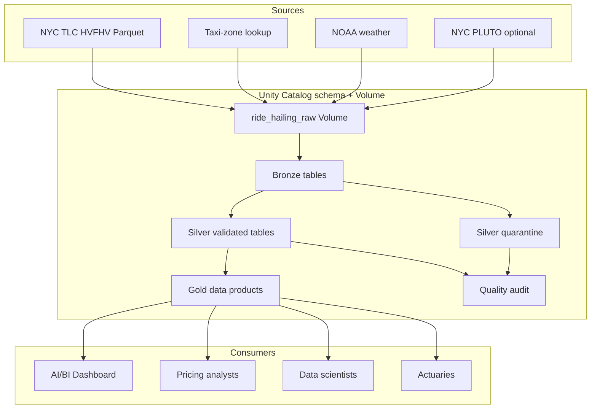

# Architecture

## Design objective

The pipeline converts a notebook-heavy research workflow into governed, reusable analytical data products. Transformation responsibilities are separated by data quality and consumer readiness instead of being mixed with exploratory analysis.

## End-to-end flow

## Layer responsibilities

### Bronze

- Preserve source columns.
- Add `_source_file`, `_source_month` and `_ingested_at` metadata.
- Generate a deterministic SHA-256 `trip_id`.
- Use Delta `MERGE` to avoid inserting an already-seen trip.

### Silver

- Validate timestamps, locations, distance, duration and financial values.
- Store all validation failures in `dq_reasons` before splitting clean and quarantined rows.
- Deduplicate by `trip_id`, retaining the latest ingestion.
- Standardise zone strings and hourly weather observations.

### Gold

- Publish daily and hourly zone-level demand and commercial metrics.
- Join weather features for downstream pricing and modelling.
- Isolate airport performance for operational analysis.
- Publish one date-aware `dashboard_trip_metrics` view with the common date, borough, zone and provider dimensions needed by every trip-based dashboard visual.

### Operations and governance

- Append each validation result to `pipeline_quality_audit`.
- Fail the notebook when critical checks fail.
- Use Delta history for operation-level traceability.
- Place raw files and managed tables under Unity Catalog for lineage and access control.

## Idempotency

The source-specific trip key combines provider, dispatch base, request/pickup/drop-off timestamps, locations and distance. Reprocessing a source batch updates existing Silver records and does not duplicate Bronze trips. Gold tables are deterministic rebuilds from the current trusted Silver state.

## Production evolution

For production use, the notebook can be separated into Databricks Workflows tasks, with Auto Loader or Lakeflow Declarative Pipelines for ingestion, expectations for quality enforcement, environment-specific catalogs, CI/CD through Databricks Asset Bundles and alerts routed to an operational channel.
